# CG 大作业

## 一、总体目标与最终效果

### 1、总体目标

我们的基本目标是，实现光线追踪算法，渲染出一个场景，需要支持基本的材质和三角面物体的渲染。具体而言，我们的场景包括一个全景环境贴图（顺带可以实现全局光照），多个不同材质的平面、球体、立方体、与三角面复杂模型。实现的 GUI 功能有三角面物体的查看，以及材质、物体的管理，此外，还需要有视窗参数的修改等。

### 2、实现情况

下面简单列举了项目的功能实现情况：该项目参考了 [仓库](https://github.com/wulinjiansheng/WebGL_PathTracer/tree/master) ，并对代码进行了完全的重写和重构，在此基础上加入了更复杂的功能。

其中原项目实现了：

- 基于完全场景遍历的路径追踪算法。
- 基本物体 Sphere、Cube、Plane 的相交测试。
- 基本的漫射、反射、折射材质。

本项目（本次大作业）新增和改进了以下方面：

- 修复：球体的相交测试中，对法线的 Model 矩阵变换修正。
- 修复：SSAA 采样算法修正。
- 修复：折射 IOR 计算修正。

- 改进：使用 ES6 模块以及 OOP 完全重构了原项目的逻辑代码，使其更易于扩展（当然还有许多可以抽象并简化的地方，其中有大量因需要与 WebGL 混编而作出的妥协）。
  - 新增：渲染器类（class Renderer）、视角类（class ViewConfig）、交互类（class Interactions）的抽象与数据存储。
  - 新增：场景类（class Scene）的抽象与数据存储。
- 改进：重写了 Shader 代码，使其更加清晰。
  - 新增：各材质的数据提取与访问方法。
  - 改进：求交代码逻辑与路径追踪材质应用逻辑。
- 改进：材质与物体的分离，使得材质可以被多个物体共享。
  - 新增：物体类（class Obj）、材质类（class Material）的抽象与数据存储。
  - 新增：逻辑代码中对材质和物体的抽象与数据存储。
- 改进：重写 GUI 模块，并增加一些功能，使其更加清晰易用。

- 新增：BVH 加速数据结构的构建与 Shader 遍历。
  - 新增：基于 BVH 的第一级加速结构，使得场景遍历（相交测试）的时间复杂度从 $ O(n) $ 降低到 $ O(\log n) $。
  - 新增：基于 BVH 的第二级加速结构，使得三角面的相交测试的时间复杂度从 $ O(n) $ 降低到 $ O(\log n) $。
  - 新增：用于统一管理两级 BVH 结构数据的类（class BVHs）。
  - 新增：AABB 包围盒类（class AABB）。
  - 效果：（在 MacBook Pro 14' M2 Pro 上）
    - 无三角面物体（删除第二级 BVH 相关代码）：120+fps
    - 无三角面物体（场景共 0 个面）：70fps
    - 有三角面物体（场景共 4000 个面，若无 BVH 结构已无法正常渲染）：40fps
    - 有三角面物体（场景共 9.1 万个面）：20fps
- 新增：三角面物体的加载 (Wavefront .obj format，基于 obj-file-parser) 和渲染（基于以上 BVH 加速结构）。
  - 新增：三角面物体相关类（class MeshModels、class Mesh、class TriangleArray、class Triangle）的加载、存储和 Shader 访问。
  - 新增：Shader 中三角面的相交测试。
- 新增：环境材质加载

已发现的问题和待改进的地方：

- 问题：当前项目仅在 MacBook Pro 14' M2 Pro 上测试过，Chromium 内核浏览器和 Safari 均可正常运行，其他设备上可能存在兼容性问题。
  - （已知 Windows Chromium 无法正常执行二级 BVH 部分，会导致浏览器崩溃，若将 Shader 中判断 tempObj.objType == 3 部分删除，即放弃掉三角面物体的渲染可正常运行，目前不清楚原因所在，欢迎感兴趣的朋友pr）
- 待改进：对次表面反射的物理实现。

### 3、最终效果

#### 3.1 场景概览

可以同构拖动鼠标左键旋转视角，拖动鼠标中键平移视角，拖动鼠标右键缩放视角。

场景中：
- 下方五个球分别为 漫反射材质、镜面反射材质、折射（玻璃）材质、磨砂玻璃、磨砂金属材质。
- 猴头为三角面物体，由 Blender 导出，使用了一次表面细分，开启了平滑着色（法向光滑），共有 3936 个三角面，与磨砂金属球使用同一个材质。
- 二十面体也为三角面物体，由 Blender 导出，使用平直着色，共有 20 个三角面，和玻璃球使用同一个材质。
- 上方中空玻璃球使用两个球体嵌套，外层球体使用玻璃球相同的材质，内部球体使用折射率为 1.0 的折射材质（即空气），产生了空心球体的效果。
- 四周墙面均为不同颜色的漫射材质。
- 顶部灯光使用了发光材质，产生了光照效果。

#### 3.2 Settings 面板

可以开启/关闭 SSAA 和 环境贴图，并调整分辨率、FOV、最大迭代次数。

**SSAA 对比**

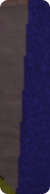

#### 3.3 编辑材质

可以在材质栏中编辑任意材质的任意属性，或者增加新的材质。

#### 3.5 修改物体

可以在物体栏中修改任意物体的任意属性，特别的，由于 Shader 中对法向进行了 Model 修正，所以对物体进行 Model 矩阵变换不会得到错误的效果。此外，还可以修改 materialID 和 meshID 为 material 和 mesh 面板中对应项的 ID，来实现更换材质和三角面物体的效果。

#### 3.6 新增、删除物体与压力测试

这里我们新增一个三角面物体，使用具有9.1万三角面的中国龙模型，可以看到，场景中的物体数量增加了许多，但是渲染效果仍然很流畅。

## 二、项目运作结构介绍

这里以 pt.frag 文件（即路径追踪 Shader）中的一次光线追踪为例，制作了一个流程图，用以简述我们项目中的代码是如何将各种数据管理组织起来并用于渲染的。

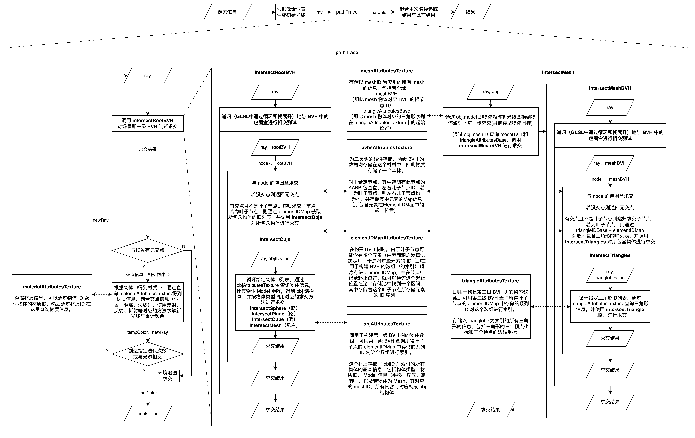

## 三、光线追踪简述

利用课上提供的相关办法，有以下的重点

### 1. 光线追踪基本原理

光线追踪的本质是对于每一条光线，计算它与场景中的物体的相交情况，然后根据相交情况计算光线的反射、折射、漫反射等等，计算新光线的**位置、方向**，然后继续追踪，直到光线与场景中的物体不再相交，或者达到最大迭代次数，最后将所有光线的颜色乘起来，得到最终的颜色。

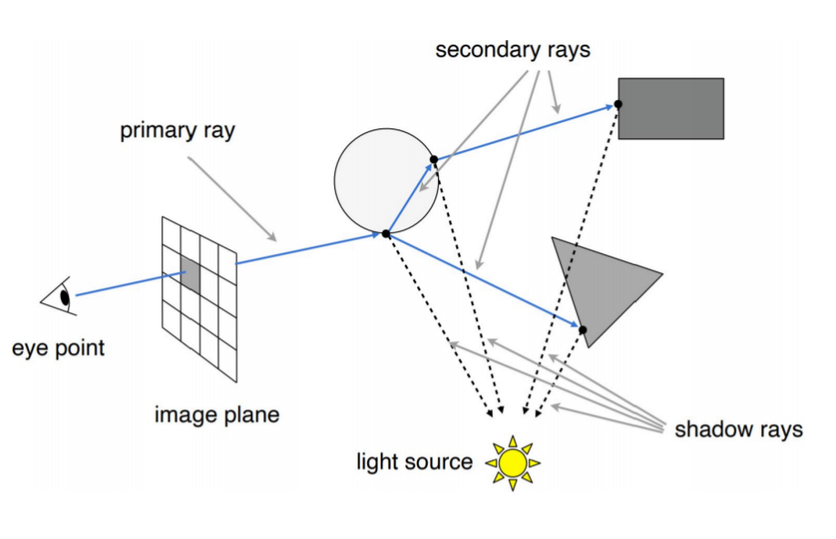

### 2. 光线与物体相交
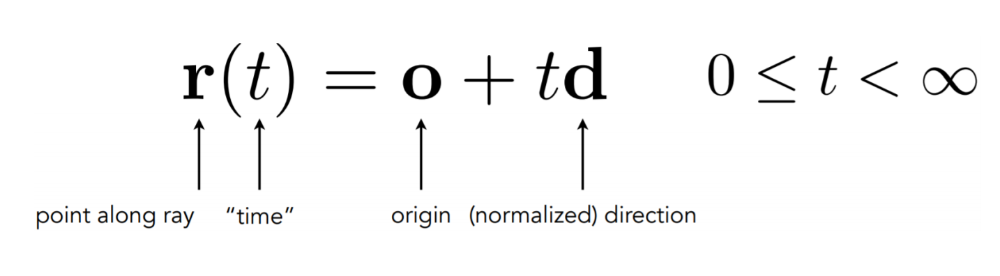

类似下面的计算可以推广到更多的物体上
**球面可以有：**
$$(o+td-c)^2=r^2$$
$$t=\frac{-(o-c)\cdot d\pm\sqrt{(o-c)\cdot d)^2-(o-c)^2+r^2}}{d\cdot d}$$

**平面可以有：**
$$n\cdot (o+td-p)=0$$
$$t=\frac{n\cdot(p-o)}{n\cdot d}$$

以此类推得到之后的于**球体**相交、**三角形**相交等等的计算

### 3. 折射与反射

R为反射光线，I为入射光线，N为法线

**3.1 漫反射**
漫反射材料的反射方向是随机的，我们可以通过随机生成一个半球内的方向向量来模拟漫反射材料的反射方向。
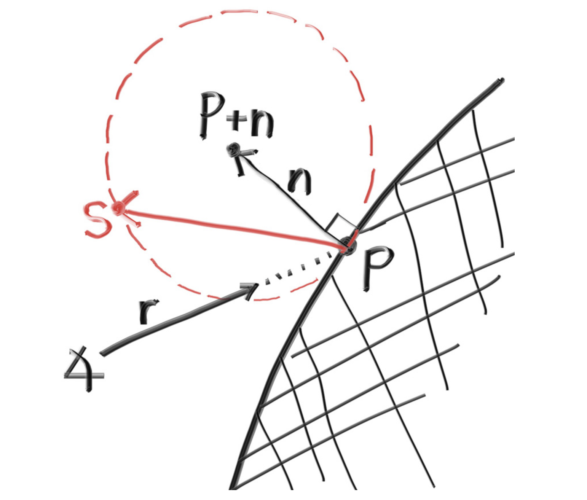

**3.2 镜面反射**

镜面反射的公式为：
$$V_{out}=V-2(V\cdot n)n$$
镜面反射材料的反射方向是确定的，我们可以通过计算反射向量来模拟镜面反射材料的反射方向。
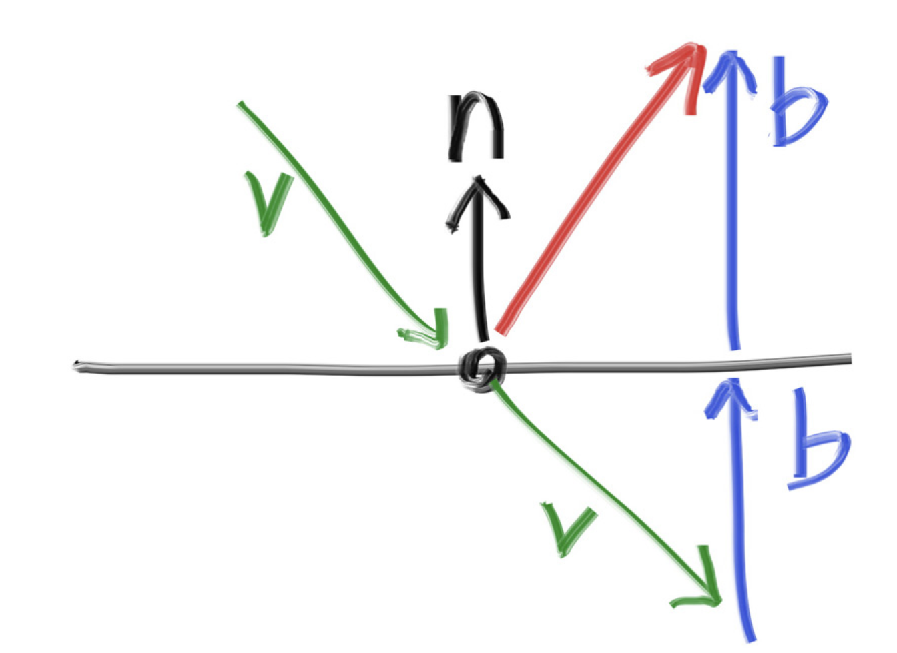

**3.3 模糊反射**
我们还可以通过使用一个小球体并为射线选择一个新的端点来随机化反射方向。我们将使用以原始端点为中心的球体表面的随机点，按模糊因子缩放。如下图所示。

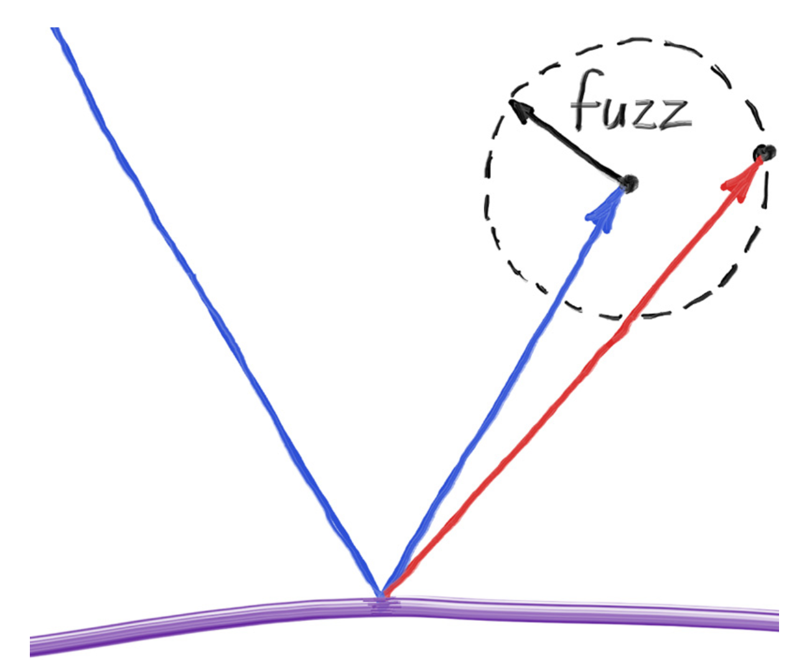

**3.4 折射**
折射的计算公式如下：
$$\eta_{to}*sin(\theta_{to})=\eta_{from}*sin(\theta_{from})$$

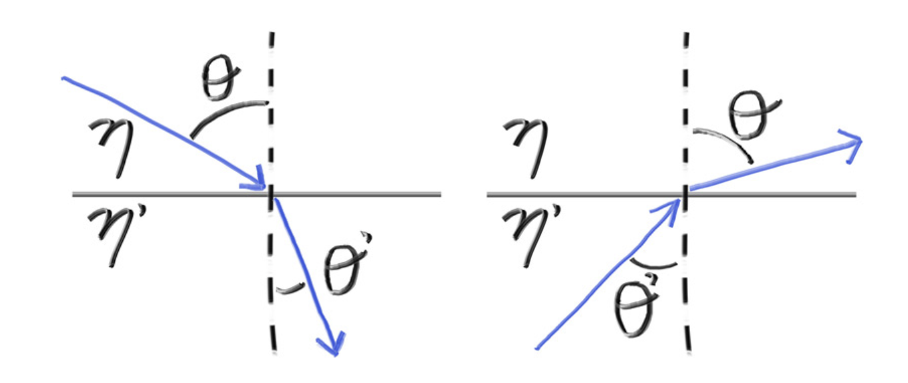

## 四、部分内容详解

### 1. 环境材质加载

简单的背景场景在观察结果是不免有些单调，于是我们选择利用课程中所学的环境贴图的相关知识，来为我们的场景增加一些材质。并且使用环境贴图还有许多优点：
1. 模拟物体所处的环境（作为背景）
2. 作为一种间接光照参与到物体的渲染运算中
3. 模拟反射、折射现象等
   

**具体实现：**
环境贴图被设置在一个无穷远处的的幕布上，可以想象在空间上一个无穷大的球体框住场景，光线与位置无关，我们只需要计算得到这束光线的夹角，就可以得到无穷远处位置，再根据球体与环境贴图关系，得到这束光线最终的颜色。
但要注意在渲染环境贴图时，要先计算出当前光线是否与场景中的物体相交，只有当这束光线与所有物体都没有相交时，才需要使用环境贴图，此时再根据上述计算方式得到得到最后这束光线的实际颜色。

### 2. BVH树

无论是碰撞检测或光线路径追踪，**缩短检测的时间**都是一项重要的事情。一旦所需求交的三角面数量增多，检测的时间就会线性增长，对于复杂三角面物体的求交就会十分缓慢。不进行筛选的光线路径追踪，每一条光线将与所有物体进行相交测试，时间复杂度将为$ O(n) $。因此使用数据加速结构无疑是必要的。而我们在本次大作业中选择使用了**BVH树**作为加速结构，可以将时间复杂度降低到 $ O(\log{n}) $ ，大大提高了效率。

**包围体：**

包围体是指给定一个物体，得到一个包裹住此物体的物体。
BVH树的每个节点都有一个包围体，包围体是一个能够包含所有子节点的最小的几何体。我们使用了AABB包围盒，即使用两个点来表示包围盒，最小点和最大点。包围盒的最小点和最大点分别是所有子节点的最小点和最大点。

#### 2.1 BVH树的构建

BVH（层次包围体技术）指的是将所有包围体分层逐次地再次包围，获得一个更大的包围体，直到包围住所有物体。实际上，它是一个树形结构，因此可以仿照树的结构，将两个或三个小的包围体包围成一个更大的包围体，以此类推。
如下图所示，与课上所讲相同
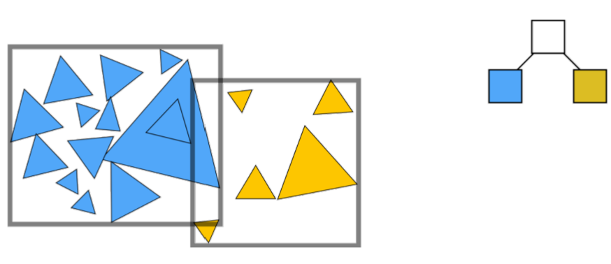

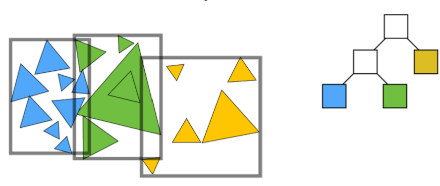

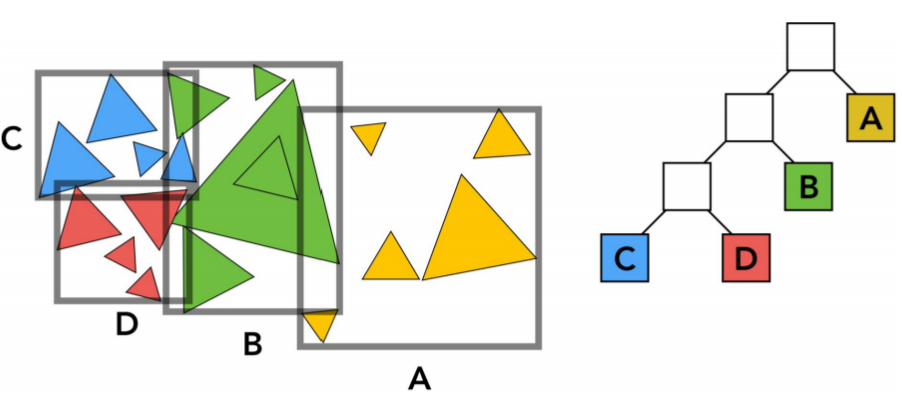

#### 2.3 表面积启发

在构建BVH树时，我们需要选择一个合适的轴来进行划分。本次大作业使用了表面积启发 (Surface Area Heuristic) 来选择划分的轴。表面积启发的思想是，划分后的两个包围体的表面积之和最小。表面积越小，光线与包围体相交的概率就越小，减少了相交测试的次数。

公式如下：
$$c(A,B)=t_{trav}+p_{A}\Sigma_{i=1}^{N_{A}}t_{isect(a_{i})}+p_{B}\Sigma_{i=1}^{N_{B}}t_{isect(b_{i})}$$
$$T=2T_{AABB}+\frac{A(S_{1})}{A(S)}N(S_{1})T_{tri}+\frac{A(S_{2})}{A(S)}N(S_{2})T_{tri}$$

其中$c(A,B)$是cost，$t_{trav}$是遍历的时间，$p$是子树的概率，$t_{isect(a_{i})}$是判断子树中第$i$个三角面相交的时间。

通过第一个公式我们可以推演此次BVH树构建的损失函数。$T$是总的时间，$T_{AABB}$是判断AABB相交的时间，$T_{tri}$是判断三角面相交的时间，$A(S_{1})$或$A(S_{2})$是子树的表面积,$A(S)$是父节点的表面积，$N(S_{1})$是左子树的三角面数量。

通过使用$T$的计算公式选取损失较小的进行表面积启发，我们可以得到一个更加紧凑的BVH树，避免出现BVH树失衡，甚至退化成为链表的情况，从而减少了相交测试的次数。

BVH树的构建方法：
1. 计算出当前节点的 $T$
2. 计算按照$x$ , $y$ , $z$ 轴划分的两个子节点的 $T$
3. 选取三种分法中 $T$ 最小的进行扩展，若没有最优则随机选取
4. 扩建到新增叶节点时间比不使用的时间更长，则停止构建

#### 2.5 本次大作业中BVH的应用

**————基于 BVH 的第一级加速结构**

我们将所有的物体都放在一个 BVH 中，然后将 BVH 的根节点作为场景的根节点。这样做的好处是，我们可以在光线与场景相交前，先与 BVH 的根节点相交，从而减少了相交测试的次数，使得场景遍历的时间复杂度从 $ O(n) $ 降低到 $ O(\log n) $。

**————基于 BVH 的第二级加速结构**

再针对每个场景中的物体，对于构成物体的每个三角面再构建各自的BVH树，这样构建使得计算光线相交时可以先通过第一级加速结构确定大致物体，再通过第二级加速结构确定相交于哪个三角面。这样使得三角面的相交测试的时间复杂度从 $ O(n) $ 降低到 $ O(\log n) $。

并且这样分级可以在求的大致物体相交后，将光线转换到物体坐标系下，再进行对应物体或三角面的相交测试。这样的话，当我们对三角面物体进行 Model 矩阵变换时，不会影响到三角面的相交测试，避免了修改 Model 矩阵后需要重构对应 mesh 的 BVH 树的问题。

### 3. GUI 与相关功能的实现

为了能够快速地搭建交互UI，我们选择了lil-gui。他可以获取一个对象和该对象上的属性名，并根据属性的类型自动生成一个界面组件来相应式地操作该属性。使用后，可以通过界面组件来控制场景中的物体，同时也可以提高调试和使用的效率。

我们实现了以下控制组件：

#### 3.1 Informations
我们将WebGL的初始化时间和Shader的初始化 时间显示在了界面上，方便分析不同优化方法的效果。
还将时间、内存和帧率信息整合在了界面上。并附上了界面操作的说明。

#### 3.2 Settings

**1） SSAA**

超采样抗锯齿是一种抗锯齿的方法，在光栅化管线中，它的原理是每个像素被分成4个或更多小像素，我们在每个小像素上计算和存储depth_buffer和frame_buffer，最后再根据4个小像素的平均值，算出原像素的值，这样就可以得到抗锯齿的图像。
而在光线追踪中，我们可以在每个像素范围内随机发射多条初始方向略微不同的光线，然后再根据这些光线的平均值，获得抗锯齿图像。

**2）resolution**: 分辨率 

**3）FOV**: 调整镜头视角

**4）Enable Env Texture**:是否开启环境贴图

若关闭，环境光极弱，场景偏暗.

**5）Max Bounces**:最大迭代次数

可以看到设置为1次的时候，场景中的物体都是黑色的，因为只有一次迭代，光线只能与物体相交一次，无法计算出反射、折射等效果；2次时只有光线第一次照射的地方有亮光；3次后基本能看到物体形状和材质

#### 3.3 Meshes

物体ID、名称, 并且显示物体拆成的三角形网格个数。

#### 3.4 Materials

存有材质的固有特征，例如名称、颜色、是否反射以及光滑度、是否折射以及折射率、发光度。可以新增和删除材质

#### 3.5 Objects

在Objects栏中可以对物体进行操作，包括物体的名称、种类、位置、旋转信息、ID信息（用于绑定材质以及导入的物体）。也可以新增和删除物体。